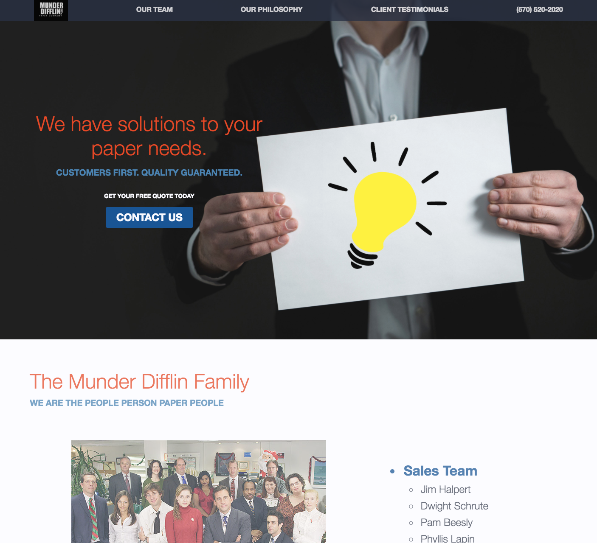
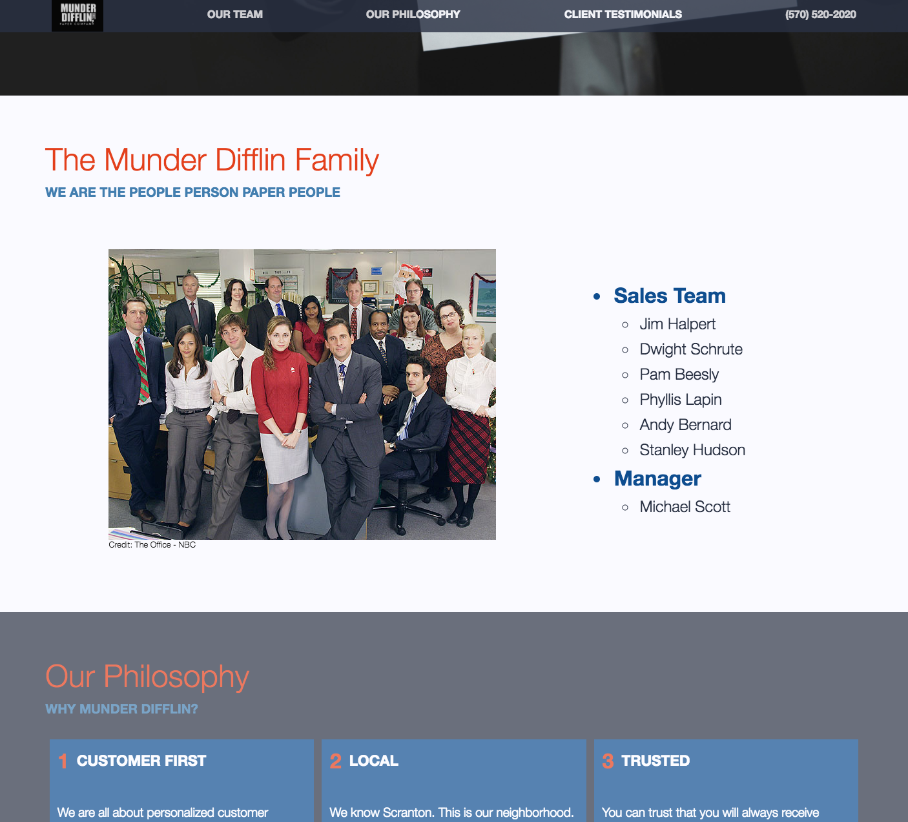
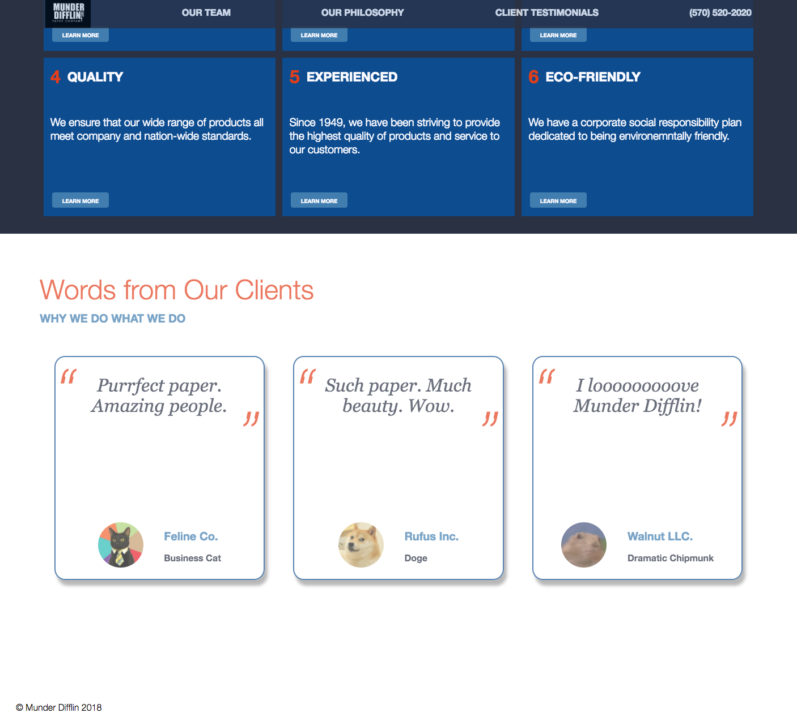

# Munder Difflin
## Website for a fictional modern paper company
* Built in 1.5 days with Vanilla CSS and JS

- Lightbulb flashes (animation) upon page load

- Current section is always in focus

- Clean layout and design

## Focus and Direction
* From the beginning ~~(30 hours ago)~~, my goal has been to portray Munder Difflin (MD) as a company that is **passionate about customer service**.
* My challenge is to help them present their paper products in an *exciting* way to their clients, who are mostly small businesses in suburban Pennsylvania.
* The environment in their office is rather non-traditional, so I decided to use vibrant colors with a hint of boldness to display their **friendly yet trendy** side.
* Halfway through building the structure, I realized that I needed to move up the "Our Team" section, given MD's emphasis on the personal touch—they are, after all, the *Paper Person Paper People*. In this section, I listed names of the front office sales staff ~~(as well as their manager's so as to please him)~~ and used a photo of key team members.
* I decided to showcase their six most important philosophies next in an eye-catching grid format. These qualities are what distinguishes MD from their competitors.
* A section with *"actual"* quotes from their customers is also included to show that they're satisfied with MD's service and products.
* The most exciting feature is probably the flickering lightbulb that users can see upon loading the webpage. A MD associate is showing a piece of paper that is not just paper. It is representative of what MD actually sells, **solutions to their client's paper needs with a human touch**, rather than just their quality products.

## Acknowledgements

* [Button hover animation](https://github.com/IanLunn/Hover) by Ian Lunn
* [Flicker keyframe animation](http://animista.net/play/entrances/flicker-in) by Animista
* Inspiration: [Digital Nomad Book](https://www.and.co/digital-nomad-book)
